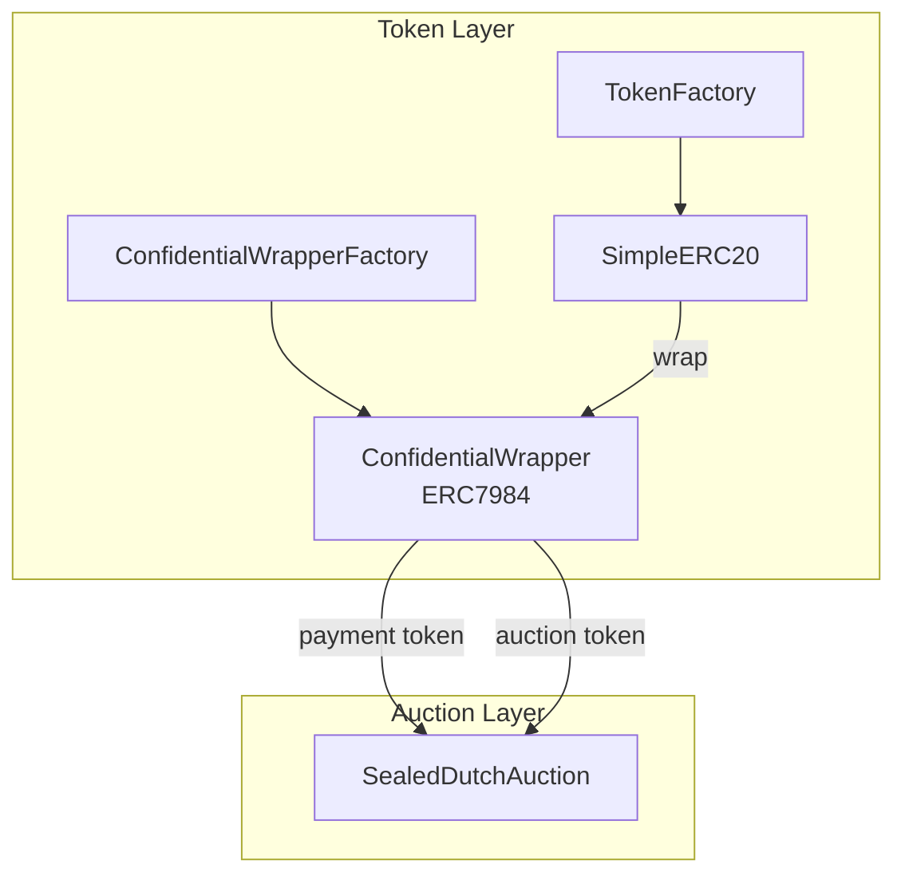
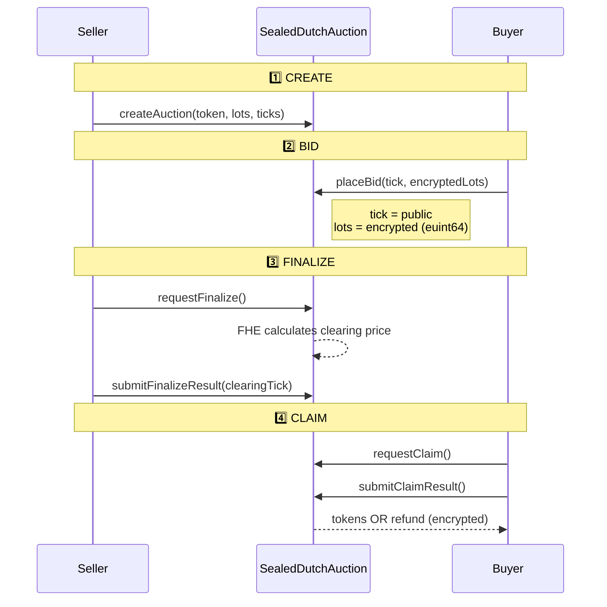

# ZipherLaunch

**Confidential Token Launchpad & Private Auctions** - Powered by FHE (Fully Homomorphic Encryption)

[](https://youtu.be/Cxb1vRt0ATw)
[](https://zipher-launch.vercel.app/)

## ℹ️ About

**ZipherLaunch** is a next-generation decentralized launchpad and auction platform built on **FHE (Fully Homomorphic Encryption)**.

Traditional blockchains suffer from transparency issues where sensitive data—like bid amounts and token balances—are visible to everyone. This leads to **front-running (MEV)** and privacy leaks.

ZipherLaunch solves this by using **Zama's FHEVM** technology to enable:
- **🔒 Confidential Token Wrappers**: Wrap standard ERC20 tokens into confidential counterparts (ERC7984).
- **🙈 Sealed-Bid Auctions**: Place encrypted bids that no one (not even the auctioneer) can see until the auction ends.
- **🛡️ Fair Market Price**: A Dutch Auction mechanism combined with encrypted bids ensures the fairest clearing price without market manipulation.

## 🏗️ Architecture

```
Bind-auction/
├── contracts/          # Solidity smart contracts (Hardhat + FHEVM)
├── app/                # Next.js 15 frontend (RainbowKit + Wagmi)
├── docs/               # Documentation
└── package.json        # Monorepo scripts
```

### Contract Architecture



### Auction Flow



## ⚡ Quick Start

### Prerequisites
- Node.js v18+
- MetaMask or compatible wallet

## 📚 Documentation

Detailed guides to help you navigate ZipherLaunch:

| Guide | Description |
|-------|-------------|
| [**User Flow Guide**](docs/user-flow.md) | Step-by-step walkthrough: Wallet Setup → Wrapping → Bidding |
| [**Auction Logic**](docs/auction-logic.md) | Deep dive into the Sealed-Bid Dutch Auction mechanics & math |

### 1. Install Dependencies
```bash
npm run install:all
```

### 2. Run Local Development

**Terminal 1** - Start local blockchain:
```bash
npm run chain
```

**Terminal 2** - Compile & deploy contracts:
```bash
npm run compile
npm run deploy:local
npm run export-abi
```

**Terminal 3** - Start frontend:
```bash
npm run dev
```

Open [http://localhost:3000](http://localhost:3000)

### 3. Deploy to Sepolia Testnet

**Step 1** - Setup `contracts/.env` (for deployment):
```env
# contracts/.env
PRIVATE_KEY=your_64_char_hex_private_key
SEPOLIA_RPC_URL=https://1rpc.io/sepolia
ETHERSCAN_API_KEY=your_etherscan_api_key
```

**Step 2** - Get Sepolia ETH from faucet:
- [Alchemy Faucet](https://sepoliafaucet.com)
- [Google Cloud Faucet](https://cloud.google.com/application/web3/faucet/ethereum/sepolia)

**Step 3** - Deploy & Verify:
```bash
npm run compile
npm run deploy:sepolia
npm run verify:all
npm run export-abi
```

**Step 4** - Create `app/.env.local` (for frontend):
```env
# app/.env.local (copy addresses from deploy output)
NEXT_PUBLIC_TOKEN_FACTORY_ADDRESS=0x...
NEXT_PUBLIC_WRAPPER_FACTORY_ADDRESS=0x...
NEXT_PUBLIC_GATEWAY_ADDRESS=0x92C920834Ec8941d2C77D188936E1f7A6f49c127
NEXT_PUBLIC_SAMPLE_TOKEN_ADDRESS=0x...
NEXT_PUBLIC_CUSDC_ADDRESS=0x...
NEXT_PUBLIC_AUCTION_ADDRESS=0x...
```

> ⚠️ **Important**: `contracts/.env` and `app/.env.local` are **different files** in different folders!

**Step 5** - Run frontend:
```bash
npm run dev
```

---

## 📜 Available Scripts

| Script | Description |
|--------|-------------|
| `npm run install:all` | Install all dependencies (contracts + app) |
| `npm run chain` | Start local Hardhat node (chainId: 31337) |
| `npm run compile` | Compile smart contracts |
| `npm run test` | Run contract tests |
| `npm run deploy:local` | Deploy to local Hardhat network |
| `npm run deploy:sepolia` | Deploy to Sepolia testnet |
| `npm run verify:all` | Verify all contracts on Etherscan |
| `npm run export-abi` | Export ABIs to frontend |
| `npm run dev` | Start frontend dev server |
| `npm run build` | Build frontend for production |
| `npm run clean` | Clean all build artifacts |
| `npm run clean:contracts` | Clean all build artifacts in contracts folder |
| `npm run clean:app` | Clean all build artifacts in app folder |

---

## 🌐 Networks

### Local (Hardhat)
- **Chain ID**: 31337
- **RPC**: http://127.0.0.1:8545
- No private key needed - Hardhat provides test accounts

### Sepolia Testnet
- **Chain ID**: 11155111
- Requires in `contracts/.env`:
```env
PRIVATE_KEY=your_64_char_hex_private_key
SEPOLIA_RPC_URL=https://1rpc.io/sepolia
ETHERSCAN_API_KEY=your_etherscan_api_key
```
- Get Sepolia ETH: [sepoliafaucet.com](https://sepoliafaucet.com)
- Get Etherscan API: [etherscan.io/apis](https://etherscan.io/apis)

---

## 🔐 Smart Contracts

### Token Creation & Wrapping
| Contract | Description |
|----------|-------------|
| `TokenFactory` | Factory to create new ERC20 tokens |
| `SimpleERC20` | Template ERC20 token created by factory |
| `ConfidentialWrapperFactory` | Factory to create ERC7984 wrappers |
| `ConfidentialTokenWrapper` | Wraps ERC20 → Confidential ERC7984 |

### Auction System
| Contract | Description |
|----------|-------------|
| `ConfidentialERC20` | FHE-enabled ERC20 token (cUSDC) |
| `SealedDutchAuction` | Main auction contract with encrypted bids |
| `MockGateway` | Mock gateway for async decryption testing |

After deployment, update `app/.env.local`:
```env
NEXT_PUBLIC_TOKEN_FACTORY_ADDRESS=0x...
NEXT_PUBLIC_WRAPPER_FACTORY_ADDRESS=0x...
NEXT_PUBLIC_GATEWAY_ADDRESS=0x...
NEXT_PUBLIC_SAMPLE_TOKEN_ADDRESS=0x...
NEXT_PUBLIC_CUSDC_ADDRESS=0x...
NEXT_PUBLIC_AUCTION_ADDRESS=0x...
```

---

## ✨ Features

### 🪙 Create ERC20 Tokens
- Create custom ERC20 tokens with name, symbol, decimals
- Track all tokens created by you

### 🔒 Wrap to Confidential
- Convert public ERC20 → Confidential ERC7984
- Balances are encrypted using FHE
- Supports wrap/unwrap operations

### 🏷️ Sealed-Bid Dutch Auction
- **Confidential Bidding** - Bid quantities encrypted with FHE (euint64)
- **Dutch Auction** - Price descends; lowest successful bid sets clearing price
- **Privacy Preserved** - No one sees bid quantities until claim
- **Encrypted Refunds** - Fully confidential refunds

---

## 🛠️ Tech Stack

**Frontend:**
- Next.js 15
- RainbowKit + Wagmi v2
- TailwindCSS
- fhevmjs

**Contracts:**
- Solidity 0.8.24
- Hardhat
- @fhevm/solidity

---

## ⚠️ Known Issues

- `bigint-buffer` warnings from `fhevmjs` - safe to ignore
- `WalletConnect Core already initialized` - cosmetic warning, does not affect functionality

---

## 📝 License

MIT
